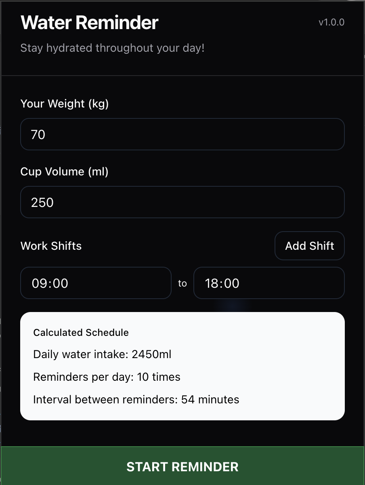

# Water Reminder - Stay Hydrated! 💧



A friendly browser extension that helps you maintain healthy hydration habits by sending timely reminders to drink water throughout your day.

## Features

- ⏰ Customizable reminder intervals
- 💧 Track daily water intake
- 🌙 Quiet hours mode
- 📊 Daily and weekly hydration statistics
- 🎯 Daily water intake goals
- 🔔 Gentle browser notifications

## Installation

1. Clone the repository:
```bash
git clone https://github.com/VuThanhThien/water-reminder-extension
cd water-reminder-extension
```

2. Install dependencies:
```bash
yarn install
```

3. Build the extension:
```bash
yarn build
```

## Usage

1. Load the extension in Chrome:
   - Open Chrome and navigate to `chrome://extensions/`
   - Enable "Developer mode" in the top right
   - Click "Load unpacked" and select the `build` folder

2. Configure your preferences:
   - Set your daily water intake goal
   - Choose reminder frequency
   - Set quiet hours (optional)
   - Customize notification messages

3. Start tracking:
   - Click the water drop icon to log your water intake
   - Receive gentle reminders throughout the day
   - View your hydration statistics

## Development

1. Customize the webpack configuration in `webpack.config.js` if needed
2. Modify the `manifest.json` file to update extension details
3. Run `yarn build` to bundle your changes
4. Reload the extension in Chrome to see your changes

## Contributing

Contributions are welcome! Please feel free to submit a Pull Request.

## License

This project is licensed under the MIT License - see the [LICENSE](LICENSE) file for details.
